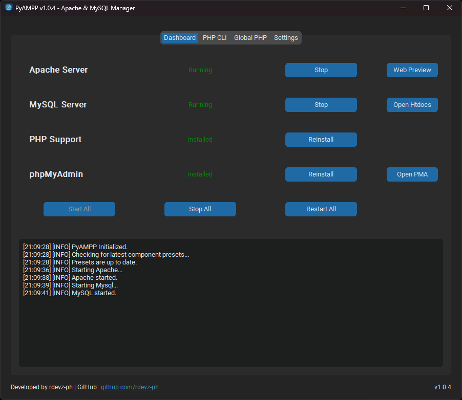
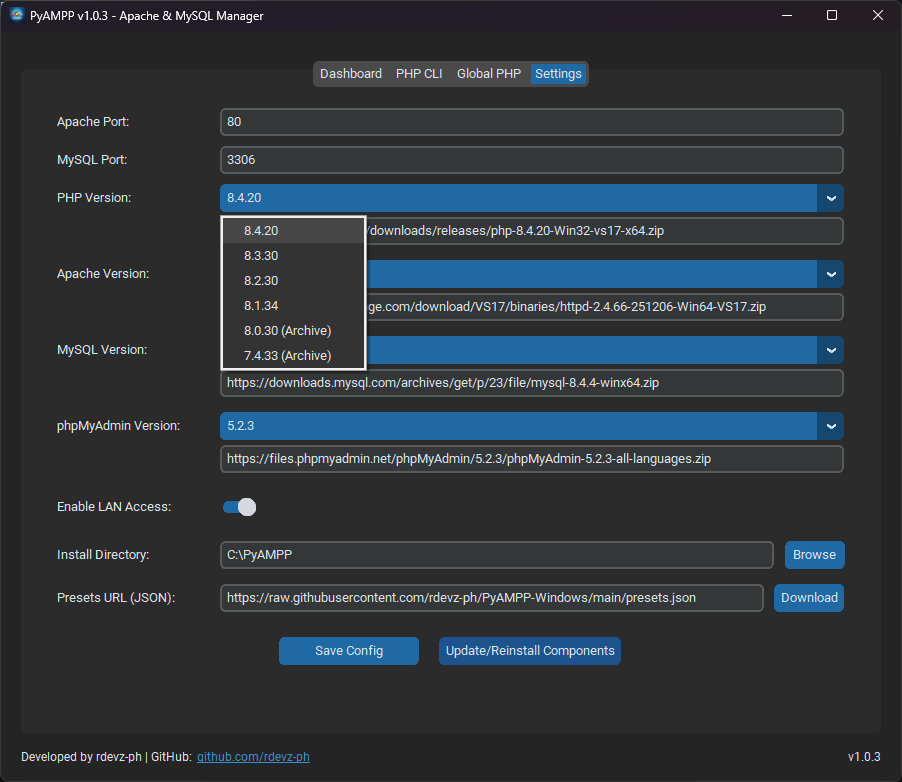

# PyAMPP: Portable Web Development Stack Manager

## Project Overview

PyAMPP is an advanced Windows-based orchestration utility designed to automate the deployment and management of a local web development environment. It provides a centralized graphical interface for the integrated management of Apache HTTP Server, MySQL Database, PHP, and phpMyAdmin.

> [!NOTE]
> This software is developed for personal use and internal development purposes. The source code is not available for public distribution or external contribution.

## Download

The latest stable version of PyAMPP can be downloaded from the official [Releases](https://github.com/rdevz-ph/PyAMPP-Windows/releases) page. Choose the latest release and download the standalone executable (`.exe`).

## Core Objectives

1.  **True Portability:** Consolidates all binaries, configuration templates, and data directories into a single root directory, ensuring the environment remains independent of the host system.
2.  **Zero-Configuration Logic:** Dynamically calculates paths, ports, and module mappings at runtime, eliminating the need for manual edits to `httpd.conf`, `my.ini`, or `php.ini`.
3.  **Automated Lifecycle:** A built-in wizard handles the retrieval, validation, and extraction of official binaries, keeping the stack current with zero administrative overhead.

## Advanced Features

### Intelligent Service Orchestration
- **Detached Execution:** Services run as independent process trees, ensuring stability even if the GUI is closed.
- **Real-Time Monitoring:** Continuous tracking of Process IDs (PIDs) and port availability with an integrated log aggregator.
- **Unified Controls:** One-click "Start All", "Stop All", and "Restart All" functionality.
- **Hardened Process Isolation:** Improved binary execution logic prevents DLL conflicts (e.g., `VCRUNTIME140.dll` mismatches) by running services in a completely isolated environment.

### Dynamic Environment Mapping
- **PHP Extension Automation:** Automatically enables and maps essential extensions (`mysqli`, `mbstring`, `openssl`, `curl`, `pdo_mysql`, `zip`, `gd`, `fileinfo`, `intl`, `exif`, etc.) using absolute local paths.
- **Global CLI Integration:** Built-in PowerShell automation to register the portable PHP binary in the System PATH, enabling CLI tools like Composer or Artisan.
- **phpMyAdmin Security:** Automated deployment with dynamic `blowfish_secret` generation and restricted local-only access controls.
- **LAN Toggle:** Rapidly switch between local-loopback and network-exposed states with automatic subnet detection for Apache access control.
- **Intelligent Module Mapping:** Dynamically detects the correct PHP module name (e.g., `php7_module` vs `php_module`) based on the active version.

### Lifecycle & Version Management
- **Version Preset Selection:** Choose specific versions for each component from a curated list of presets (from PHP 7.4 to 8.4).
- **Smart Reinstallation & Cleanup:** Performs a clean sweep of old binaries while strictly preserving MySQL data when updating or switching versions.

## Supported Versions (Presets)

PyAMPP v1.0.3 supports a wide range of verified component versions. For full transparency, you can verify all official binary download URLs in the [presets.json](presets.json) file:

- **PHP:** 8.4.20 (VS17), 8.3.30, 8.2.30, 8.1.34, 8.0.30, and 7.4.33 (Archive).
- **Apache:** 2.4.66 (VS17).
- **MySQL:** 8.4.4 (LTS), 8.0.40, 5.7.44.
- **phpMyAdmin:** 5.2.3, 5.2.2, 5.2.1.

## Visual Interface

| Dashboard | Settings |
| :---: | :---: |
|  |  |

*The centralized dashboard provides real-time monitoring and one-click control over the entire development stack, while the settings panel allows for granular environment customization.*

## Technical Specifications

- **Engine:** Python 3.x
- **GUI:** CustomTkinter (Modern, High-DPI aware)
- **Networking:** Synchronous socket validation and subnet discovery.
- **Architecture:** 64-bit optimized (VS17 Runtimes).

## System Architecture

- **Core Layer:** Management of binaries, configuration templating, and low-level process control.
- **GUI Layer:** Modular dashboard, setup wizard, log aggregator, and global settings.
- **Automation Layer:** PowerShell integration for system-wide environment pathing.

## Documentation

For more detailed information, technical guides, and visual overviews, visit our documentation site:
**[View Detailed Documentation](https://rdevz-ph.github.io/PyAMPP-Windows/)**

## Frequently Asked Questions

### Why use PyAMPP instead of a modern Docker-based setup?
While Docker is extremely powerful, it can feel resource-heavy and consume significant storage, especially when building and maintaining multiple containers. PyAMPP provides a lightweight, portable alternative that is much faster to initialize and easier to manage for standard PHP development without the overhead of virtualization.

### Is PyAMPP really portable?
Yes. Everything—including binaries, databases, and configurations—is stored within the application's root directory. You can move the entire folder to a USB drive or another machine, and it will work without needing to reinstall dependencies.

### Can I add my own custom PHP or MySQL versions?
Currently, PyAMPP uses verified presets defined in `presets.json` to ensure compatibility and automated configuration. Manual additions are possible by modifying the presets file, though official support is limited to the versions listed.

### Does it require Administrator privileges?
Admin privileges are generally not required for basic operation, though they may be needed for specific automation tasks like registering PHP to the System PATH or toggling certain network firewall rules.

## Legal

Copyright (c) 2026 Romel Brosas. All Rights Reserved.
Provided under a proprietary license. See the [LICENSE](LICENSE) file for details.

## Disclaimer

PyAMPP is intended exclusively for local development and testing. Default configurations prioritize development speed over production-grade security hardening. Do not use for hosting public-facing services.
