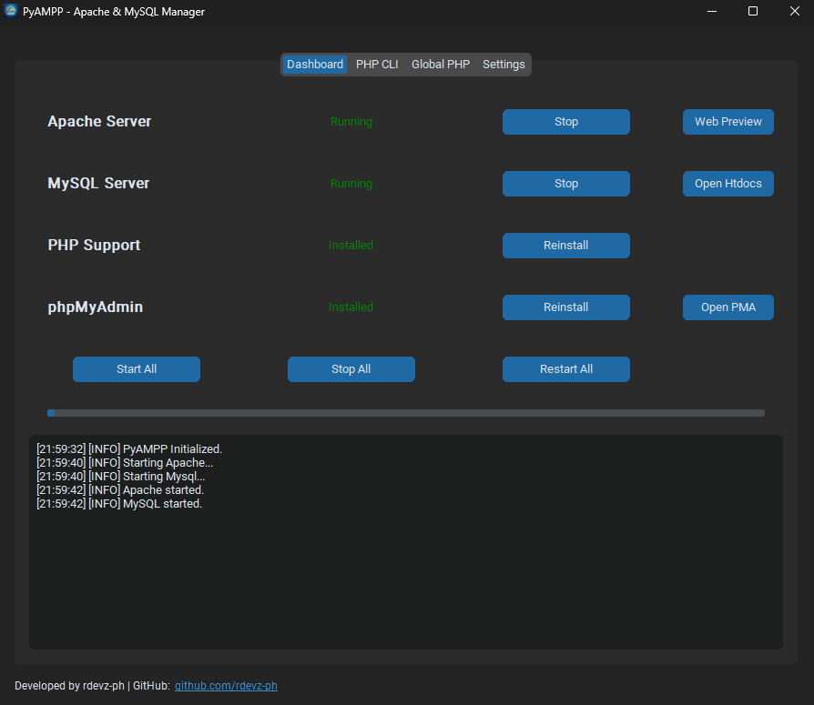

# PyAMPP: Portable Web Development Stack Manager

## Project Overview

PyAMPP is a specialized Windows-based management utility designed to automate the deployment and orchestration of a local web development environment. It facilitates the integrated management of Apache HTTP Server, MySQL Database, PHP, and phpMyAdmin through a centralized graphical interface.

> [!NOTE]
> This software is developed for personal use and internal development purposes. The source code is not available for public distribution or external contribution.

## Purpose and Development Rationale

PyAMPP was engineered to address common inefficiencies found in traditional WAMP (Windows, Apache, MySQL, PHP) distributions. The project focuses on three primary objectives:

1.  **Environment Portability:** By consolidating binaries, configuration files, and data directories into a single, user-defined root directory, the system ensures that the entire development environment remains portable and independent of system-wide installations.
2.  **Configuration Automation:** The application is distributed as a standalone Windows executable, eliminating the requirement for manual modification of configuration files (such as httpd.conf and php.ini). It dynamically calculates paths and network settings at runtime to ensure consistent service interoperability.
3.  **On-Demand Provisioning:** PyAMPP includes an automated deployment wizard that retrieves, validates, and extracts the latest compatible binaries directly from official repositories, ensuring the stack remains current with minimal administrative overhead.

## Core Features

### Automated Infrastructure Deployment
The built-in setup wizard manages the lifecycle of component installation, including remote asset retrieval, integrity verification, and directory structuring. It handles the extraction and placement of binaries to ensure a functional environment from a clean state.

### Service Orchestration
The dashboard provides granular control over system processes. Users can initialize, terminate, or restart Apache and MySQL services independently or as a unified stack. The application monitors process IDs (PIDs) and port availability to provide real-time status reporting.

### Dynamic Configuration Mapping
- **Apache Integration:** Automatically configures Module loads, DocumentRoot directives, and Directory permissions. It seamlessly maps the PHP module and handler within the Apache configuration.
- **MySQL Initialization:** Dynamically generates my.ini files based on the host environment and initializes data directories using secure-by-default parameters for local development.
- **PHP Environment:** Provides tools to register PHP within the global system path via automated PowerShell scripts, enabling CLI accessibility across the host OS.

### Network and Diagnostic Tools
- **LAN Accessibility Toggle:** Allows for the rapid switching between local-loopback and network-exposed states.
- **Integrated Logging:** Features a real-time log aggregator that captures standard output and error streams from underlying services for rapid troubleshooting.

## Technical Specifications

- **Language:** Python 3.x
- **Interface:** CustomTkinter (High-DPI aware graphical framework)
- **Process Management:** Windows Subprocess API with detached process execution.
- **Networking:** Synchronous socket monitoring for service validation.
- **Components Managed:**
    - Apache HTTP Server (Apache Lounge Binaries)
    - MySQL Community Server (8.0.x)
    - PHP (Thread Safe Distributions, 8.3.x)
    - phpMyAdmin (Multi-language Distributions)

## System Architecture

The project is structured into distinct layers to separate logic from presentation:

- **Core Layer:** Manages binary downloads, file system operations, configuration templating, and low-level process control.
- **GUI Layer:** Provides a modular interface including the primary Dashboard, Setup Wizard, and Configuration Settings.
- **Data Layer:** Maintains persistent application state and user-defined environment variables.

## Visual Interface

*The centralized dashboard provides real-time monitoring and one-click control over the entire development stack.*

- **Service Dashboard:** Real-time monitoring and control of Apache and MySQL services.
- **Setup Wizard:** Step-by-step automated deployment of core components.
- **Log Aggregator:** Real-time console output for diagnostic and verification purposes.

## Legal and Distribution

This software is provided under a proprietary license. For detailed terms of use, please refer to the [LICENSE](LICENSE) file.

## Disclaimer

PyAMPP is intended exclusively for local development and testing environments. The default configurations prioritize development speed and local accessibility over production-grade security hardening. It should not be utilized for hosting public-facing services or sensitive production data.
